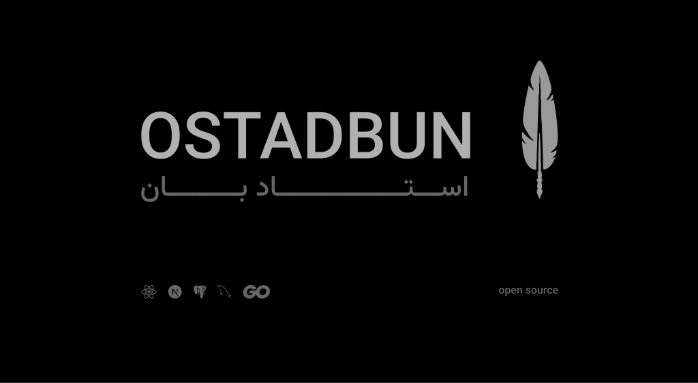

  

<h1 align="center">OSTADBUN</h1>

Open-source platform for students to discover, review, and choose professors.

---

# 📚 ABOUT OSTADBUN

OSTADBUN is an open-source platform built by students, for students.

It enables the community to share honest experiences about professors, helping others make better academic decisions through transparent reviews, ratings, and course insights.

We believe that access to reliable information leads to fairer choices, better learning experiences, and stronger academic communities.

Every review, rating, and contribution makes OSTADBUN more useful for the next student.

---

### ⚡ Powered By

`TypeScript` • `React` • `Next.js` • `Bun` • `Tailwind CSS` • `shadcn/ui` • `Zustand` • `React Hook Form` • `SWR` • `Lucide Icons`
